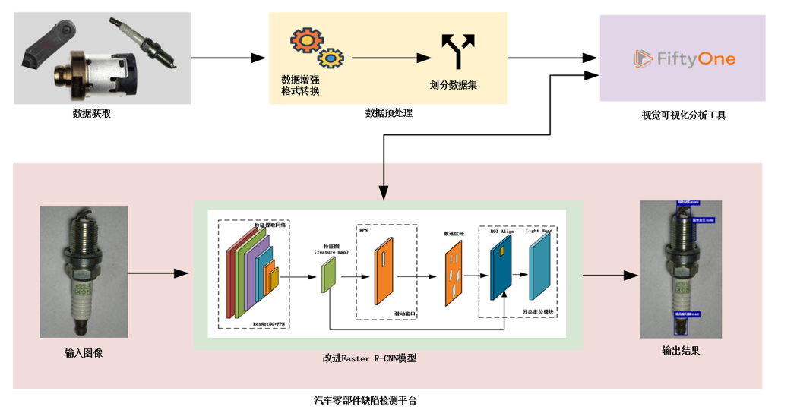

## 项目架构



1.模型改进：深入分析并改进Faster R-CNN模型，用于汽车零部件缺陷检测。主要改进包括优化了特征提取网络，减少定位误差和提高检测速度。

2.数据集构建与实验：构建专门的汽车零部件缺陷数据集，并通过实验评估改进模型的性能，同时与基准模型进行比较。

3.缺陷检测分析系统开发：开发一个缺陷检测分析系统，支持图像检测和结果保存，来提高工作效率和用户体验。

## 文件结构

```apl
│  app.py # 汽车缺陷检测平台
│  data_augumentation.py # 
│  fiftyone-0.20.1-py3-none-any.whl
│  image_transformed.py
│  inference.ipynb
│  inference.py
│  loading_data_from_fiftyone_to_detectron2.py
│  load_data.ipynb
│  load_data.py
│  README.md
│  requirements.txt
│  train.py
│
├─.idea
│  │  .gitignore
│  │  detectorn2_fiftyone.iml
│  │  misc.xml
│  │  modules.xml
│  │  vcs.xml
│  │  workspace.xml
│  │
│  └─inspectionProfiles
│          profiles_settings.xml
│          Project_Default.xml
│
├─font
│      simsun.ttc
│
├─images
│      1099_5201327_166.jpg
│      1099_5201327_166_GaussNoise.jpg
│      1099_5201327_166_HorizontalFlip.jpg
│      1099_5201327_166_RandomBrightness.jpg
│      1099_5201327_166_RandomContrast.jpg
│      1099_5201327_166_VerticalFlip.jpg
│
├─README.assets
│      image-20240320231236714.png
│
├─utils
│      car_parts_data_coco_format.py
│      car_parts_fiftyone0.1.py
│      image_transformed.py
│
├─weight
│      model_0012997.pth
│
└─__pycache__
        data_augumentation.cpython-38.pyc
        loading_data_from_fiftyone_to_detectron2.cpython-38.pyc
        loading_data_from_fiftyone_to_detectron2.cpython-39.pyc
```


## 运行指南


## 鸣谢

