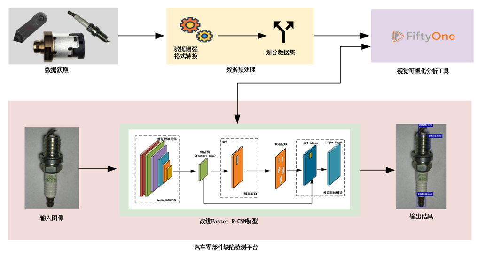
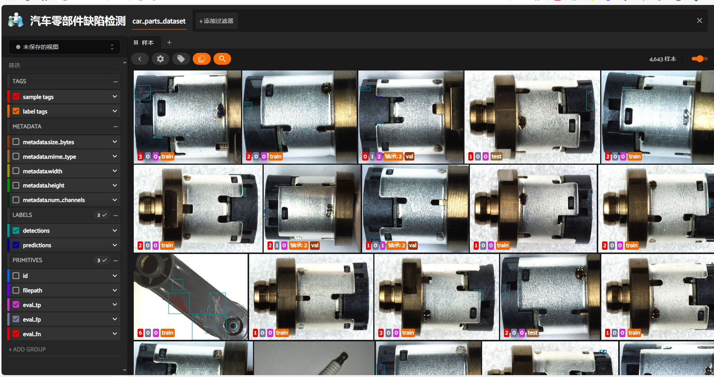
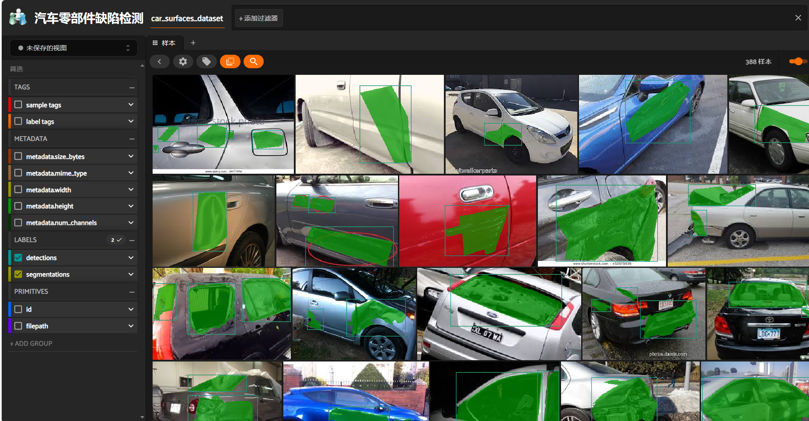
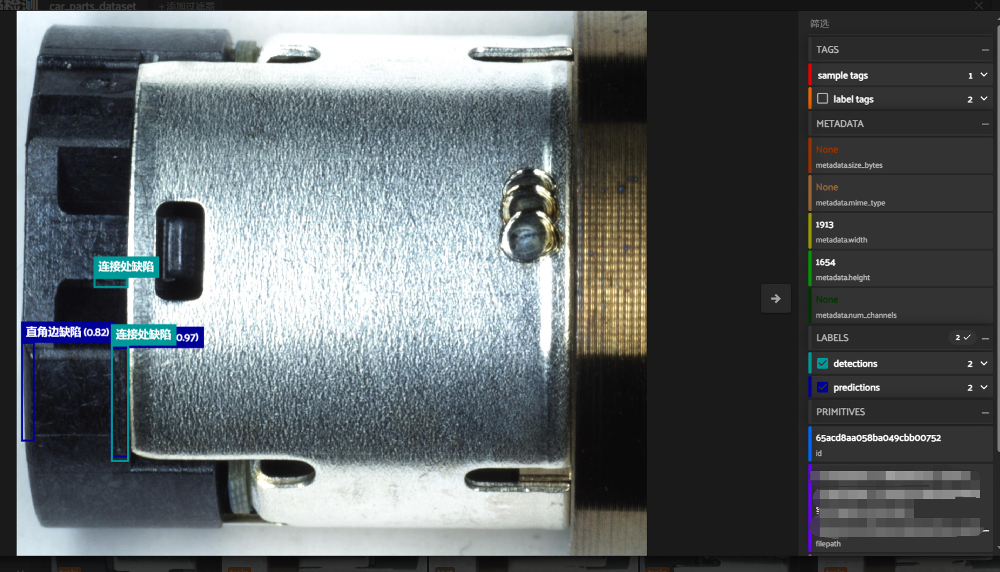
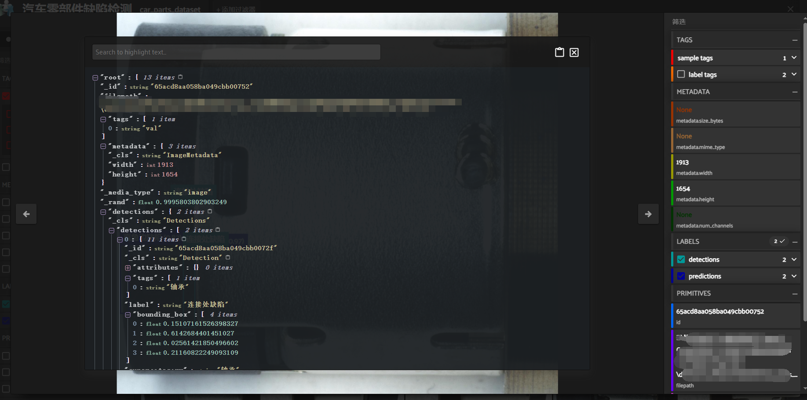
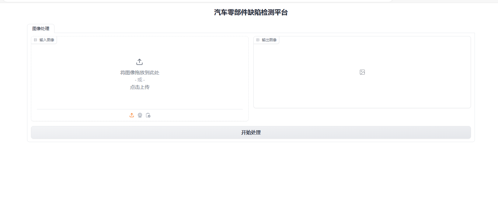
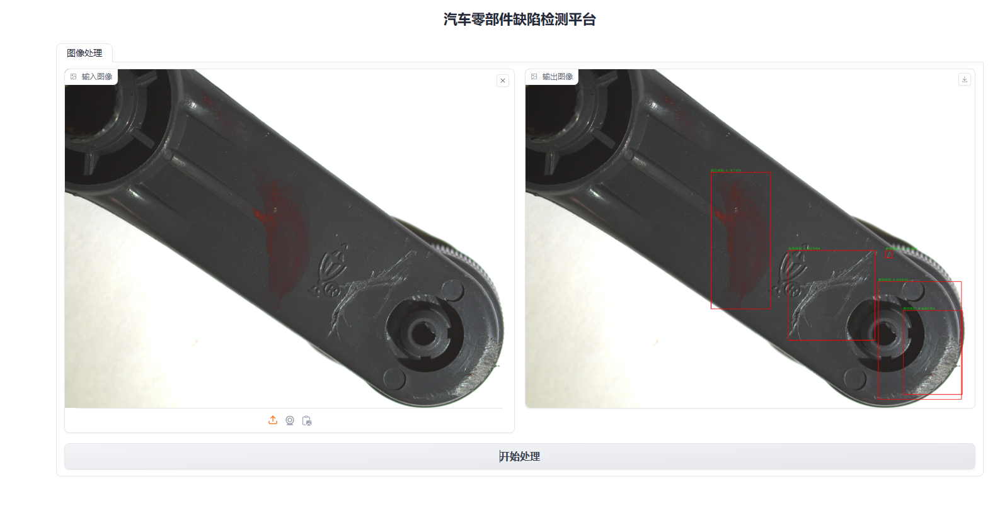

## 项目架构



## 项目概述

1. 数据集：该数据集包括3种零件，分别是轴承、摇把、火花塞，10种缺陷类型，分别颜色缺陷、划痕、磨损、间距、拔丝异常、毛刺、空洞、垂直问题、连接处缺陷、直角边缺陷。
2. 数据预处理：由于使用base64编码将图片的信息封装成一个json文件，因此需要将其进行解码成jpg形式，并将注释的内容转成COCO格式，方便后续的数据探索。其次，将获取到的数据导入到开发好的缺陷检测分析系统进行缺陷类型可视化与图像分析，然后针对分析的结果，对缺陷数据集进行数据增强。
3. 模型改进：改进Faster R-CNN模型，使用ResNet-50和特征金字塔网络（FPN）两者结合的方式作为特征提取网络，来提高网络的性能；使用ROI Align算法替换ROI 池化层中的算法，避免因为两次坐标量化问题从而导致了对小目标漏检情况，提高了对小目标的提取能力。
4. 系统开发：在开源框架FiftyOne中融合改进的Faster R-CNN模型，开发一个用于展示模型预测效果的汽车零部件缺陷检测分析系统，该系统功能包括加载模型权重、进行单张和批量图像检测、检测结果保存等，来简化工作流程，提高工作效率，能让用户直观查看模型在单个图像或者整个数据上的表现。另外的话，将图片输入、模型检测、结果输出这一过程使用gradio库封装成一个汽车零部件缺陷检测平台，支持图像检测和结果保存，来提高工作效率和用户体验。


## 演示效果

### 缺陷检测分析平台：










### 汽车零部件缺陷检测平台：





## 文件结构

```apl
│  app.py # 缺陷检测平台
│  fiftyone-0.20.1-py3-none-any.whl # fiftyone包
│  image_transformed.py # 图像变换
│  inference.py # 推理
│  loading_data_from_fiftyone_to_detectron2.py # 将fiftyone的数据加载到detectron2中
│  load_data.py # 快速浏览缺陷概况
│  README.md 
│  requirements.txt
│  train.py # 训练
│
├─.idea
│  │  .gitignore
│  │  detectorn2_fiftyone.iml
│  │  misc.xml
│  │  modules.xml
│  │  vcs.xml
│  │  workspace.xml
│  │
│  └─inspectionProfiles
│          profiles_settings.xml
│          Project_Default.xml
│
├─configs # 网络配置文件
│  ├─Cityscapes
│  ├─COCO-Detection
│  ├─COCO-InstanceSegmentation
│  ├─COCO-Keypoints
│  ├─COCO-PanopticSegmentation
│  ├─common
│  │  ├─data
│  │  └─models
│  ├─Detectron1-Comparisons
│  ├─LVISv0.5-InstanceSegmentation
│  ├─LVISv1-InstanceSegmentation
│  ├─Misc
│  ├─new_baselines
│  ├─PascalVOC-Detection
│  └─quick_schedules
├─datasets # 数据集
│  ├─car_parts_dataset
│  │  ├─data
│  │  └─evaluations
│  └─car_surfaces_dataset
│      └─data
│  
├─font # 字体
│      simsun.ttc
│
├─images # 图像增强效果
│      1099_5201327_166.jpg
│      1099_5201327_166_GaussNoise.jpg
│      1099_5201327_166_HorizontalFlip.jpg
│      1099_5201327_166_RandomBrightness.jpg
│      1099_5201327_166_RandomContrast.jpg
│      1099_5201327_166_VerticalFlip.jpg
│
├─README.assets
│      image-20240320231236714.png
│
├─utils # 工具包
│      car_parts_data_coco_format.py # 将汽车零部件缺陷数据转为coco格式
│      image_transformed.py # 数据变换
│      data_augumentation.py # 数据增强（用于detectron2框架）
│
├─weight # 模型
│      model_0012997.pth
│
└─__pycache__
        data_augumentation.cpython-38.pyc
        loading_data_from_fiftyone_to_detectron2.cpython-38.pyc
        loading_data_from_fiftyone_to_detectron2.cpython-39.pyc
```

`app.py`汽车零部件缺陷检测平台。`train.py`模型训练代码，`inference.py`模型推理代码，将detectron2框架与fiftyone进行融合，来评估模型的检测效果。`weight/`文件夹存放模型文件。` load_data.py`缺陷数据集分析平台，使用fiftyone快速浏览缺陷数据集的概况，评估缺陷数据的平衡性。`utils/car_parts_data_coco_format.py`将汽车零部件缺陷数据的注释转为COCO格式，并从json文件提取图片的信息。`utils/ data_augumentation.py`数据增强。 `loading_data_from_fiftyone_to_detectron2.py` 将fiftyone的数据加载到detectron2框架中，进行模型的训练。

### 运行指南

本项目基于 Python 编程语言，程序运行使用的 Python 版本为 3.9，建议使用 [Anaconda](https://www.anaconda.com/) 配置 Python 环境。以下配置过程已在 Windows 和Linux 上测试通过，以下为控制台/终端（Console/Terminal/Shell）指令：

#### 创建虚拟环境

```shell
conda create -n fiftyone_env python=3.9
conda activate fiftyone_env
```

#### 安装fifityone

一定要在` fiftyone-0.20.1-py3-none-any.whl`路径下执行`pip install fiftyone-0.20.1-py3-none-any.whl`才有效，不然会出现文件找不到。

```shell
pip install fiftyone-0.20.1-py3-none-any.whl
```

#### 安装pytorch

```shell
# -------------------------------------GPU版本安装------------------------------
pip install torch==1.9.1+cu111 torchvision==0.10.1+cu111 torchaudio==0.9.1 -f https://download.pytorch.org/whl/torch_stable.html
# ------------------------------CPU版本（一般服务器安装这个）---------------------------------------
pip install torch==1.9.0+cpu torchvision==0.10.0+cpu torchaudio==0.9.0 -f https://download.pytorch.org/whl/torch_stable.html
```

#### 安装detectron2

```shell
# -------------------------------------GPU版本安装------------------------------
pip install torch==1.9.1+cu111 torchvision==0.10.1+cu111 torchaudio==0.9.1 -f https://download.pytorch.org/whl/torch_stable.html
# ------------------------------CPU版本（一般服务器安装这个）---------------------------------------
pip install torch==1.9.0+cpu torchvision==0.10.0+cpu torchaudio==0.9.0 -f https://download.pytorch.org/whl/torch_stable.html
cd detectron2
pip install -e .
```

#### 安装cudatoolkit（CPU版本的服务器不需要）

```shell
# 安装
conda install cudatoolkit=11.1.1
```

#### 安装pillow

```shell
pip install pillow==9.5.0
```

#### 安装opencv

```shell
# 安装
pip install opencv-python
```

#### 安装gradio

```shell
pip install gradio
```

**安装以上这些库之后，就可以愉快地玩耍了！！！**

## 鸣谢

fifityone：https://github.com/voxel51/fiftyone

detectron2：https://github.com/facebookresearch/detectron2/tree/main
